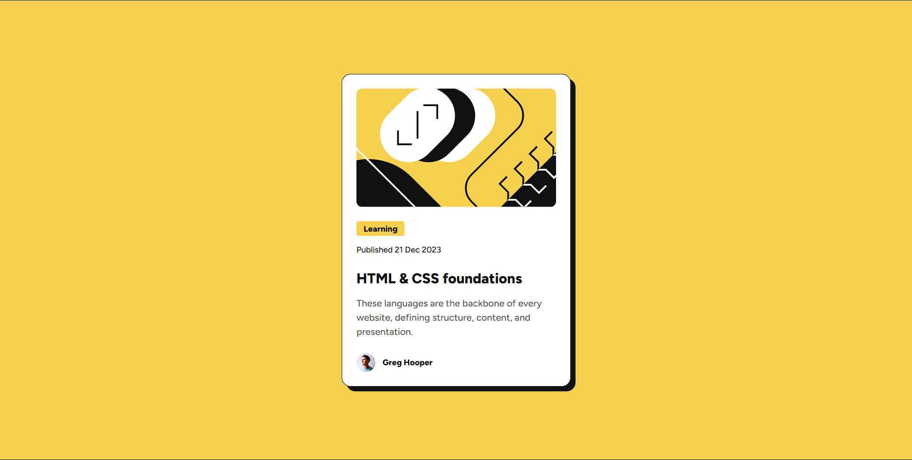

# Frontend Mentor - Blog Preview Card Solution

This is my solution to the [Blog Preview Card challenge](https://www.frontendmentor.io/challenges/blog-preview-card-ckPaj01IcS) on Frontend Mentor. I built the project using only HTML and CSS. It helped me practice layout structure, styling, and hover effects.

---

## Table of Contents

- [Overview](#overview)
  - [The Challenge](#the-challenge)
  - [Screenshot](#screenshot)
  - [Live Links](#live-links)
- [My Process](#my-process)
  - [Built With](#built-with)
  - [What I Learned](#what-i-learned)
  - [Issues Faced](#issues-faced)
  - [Continued Development](#continued-development)
  - [Useful Resources](#useful-resources)
- [Author](#author)

---

## Overview

### The Challenge

Users should be able to:

- View a blog preview card
- See hover and focus states for interactive elements (like the heading)

## Screenshot



---

## Live Links

- **Solution URL:** [Add solution URL here](https://your-solution-url.com)
- **Live Site URL:** [Add live site URL here](https://your-live-site-url.com)

---

## Built With

- Semantic HTML5
- CSS custom properties
- Flexbox
- rem units for scalable sizing
- Mobile-first approach

---

## What I Learned

- Using `rem` units for spacing and font sizes made it more scalable across different screen sizes.
- I practiced hover states using basic CSS:

```css
h1:hover {
  color: hsl(47, 88%, 63%);
  cursor: pointer;
}
```

## Issues Faced

- I had difficulty managing spacing between elements consistently.

- Adjusting font sizes across devices without media queries was challenging.

- I realized that while rem helps with scalability, media queries or clamp() are needed for true responsiveness.

---

## Continued Development

- Learn to use clamp() for responsive typography without media queries.

- Explore utility-first CSS frameworks like Tailwind CSS for better spacing control.

- Focus on mastering fluid layouts.

---

## Useful Resources

- [MDN Web Docs – Using rem units](https://developer.mozilla.org/en-US/docs/Web/CSS/font-size#values)  
  Helped me understand how `rem` units scale based on the root font size and why they're useful for consistent spacing.

- [CSS-Tricks – Responsive Typography with clamp()](https://css-tricks.com/using-calc-to-create-more-dynamic-layouts/)  
  Explained how to create fluid and responsive text sizes without media queries using `clamp()`.

- [Frontend Mentor Community](https://www.frontendmentor.io/community)  
  Great place for discussing issues, getting feedback, and learning from others’ approaches to the same challenge.

---

## Author

- Frontend Mentor – [@souledspirit](https://www.frontendmentor.io/profile/souledspirit)
- GitHub – [@souledspirit](https://github.com/souledspirit)
- Twitter – [@souledspirit](https://twitter.com/souledspirit)

---

## Acknowledgments

Thanks to the Frontend Mentor community for all the helpful discussions and solutions. I reviewed a few others' projects to understand better layout techniques and consistent spacing.
